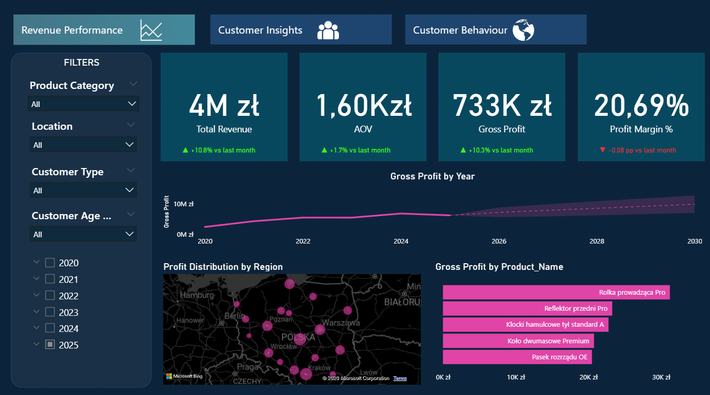
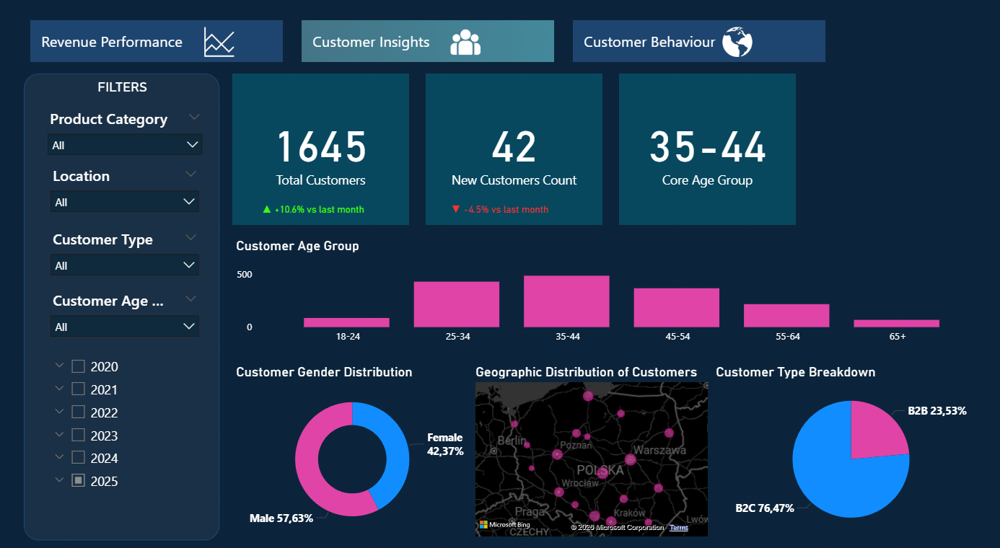
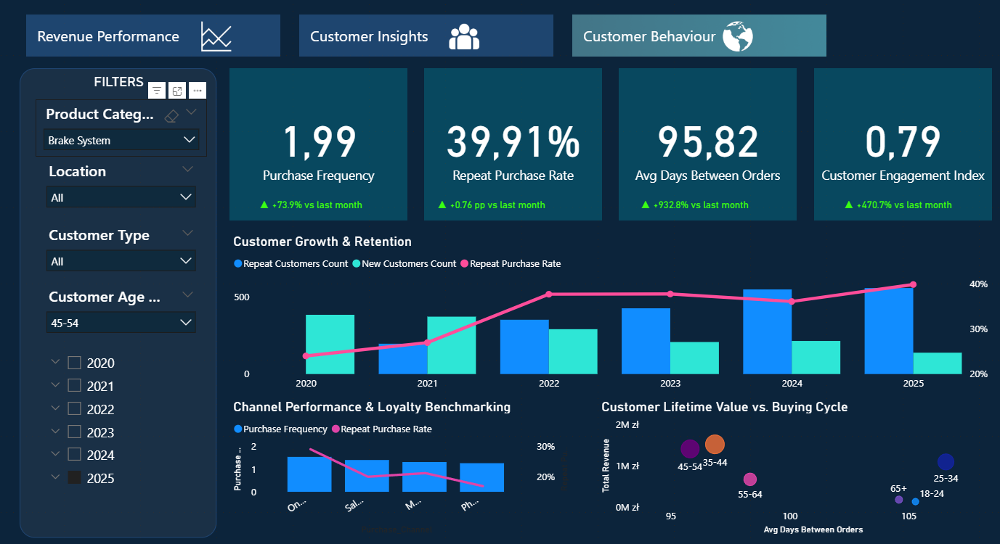
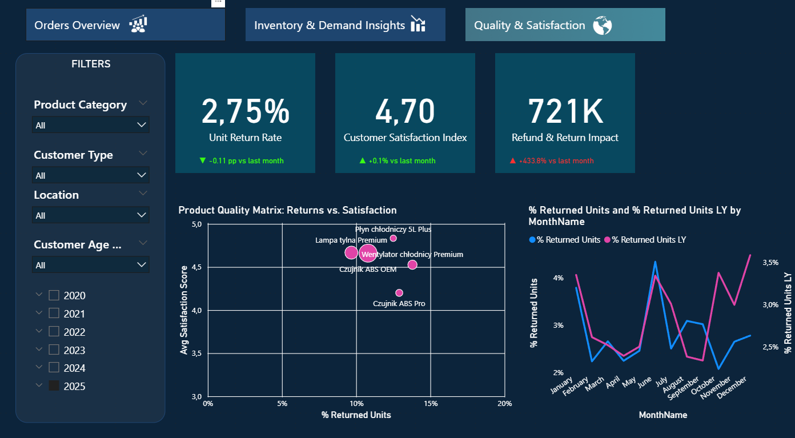
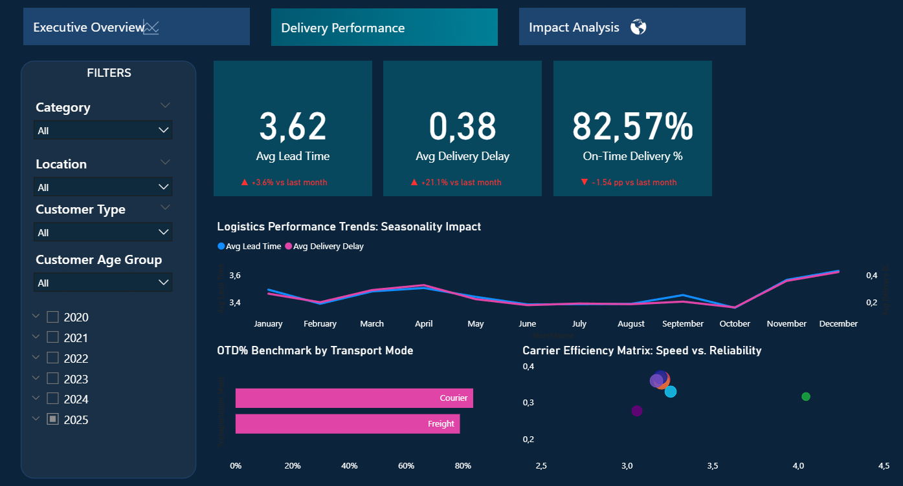

# 📊 End-to-End Data Warehouse & Power BI Dashboard

## 🔗 Project Overview

This project presents a complete **end-to-end data analytics solution** based on a simulated automotive wholesale business.

The objective was to:

* design a scalable data model
* clean and transform raw data (ETL)
* analyze customer behavior and operational performance
* deliver interactive dashboards supporting **data-driven decision-making**

---

## 🧱 Data Model

* Designed a **Star Schema** for analytical performance
* Fact tables:

  * Orders
  * Inventory
  * Shipping
* Dimension tables:

  * Customers
  * Products
  * Date
  * Location

---

## ⚙️ Data Processing (ETL)

* Data cleaning and transformation using **T-SQL**
* Handling missing values and inconsistencies
* Standardizing categories (products, locations, customer segments)
* Creating calculated columns and measures

---

## 📊 Dashboard Preview

### 💰 Revenue Performance Overview

### 👥 Customer Insights

### 🔁 Customer Behaviour & Retention

### 🔄 Returns & Customer Satisfaction Analysis

### 🚚 Delivery Performance

---

## 📈 Key Metrics (KPIs)

* Total Revenue
* Gross Profit & Profit Margin
* Average Order Value (AOV)
* Order Volume
* Return Rate (%)
* On-Time Delivery Rate (%)
* Customer Retention & Repeat Purchase Rate
* Customer Satisfaction Index

---

## 🔍 Key Insights

* 📅 Strong **seasonality patterns** – peak demand in March–April and November–December
* 🔁 Higher **return rates** linked to specific product categories and delivery delays
* 📉 Customers with lower engagement show significantly reduced repeat purchases
* 🔄 Return levels impact overall customer satisfaction
* 🚚 Delivery delays negatively impact customer satisfaction and retention

---

## 💡 Business Recommendations

* Optimize inventory levels before peak seasons
* Improve logistics performance on high-delay routes
* Monitor and reduce returns for selected product categories
* Focus retention strategies on low-activity customers
* Improve delivery time consistency to increase customer satisfaction

---

## 🛠️ Tools & Technologies

* **Power BI** – dashboards, DAX, data modeling
* **Power Query** – ETL & data transformation
* **SQL Server** – data preparation and analysis
* **Excel** – data exploration

---

## 🎯 Skills Demonstrated

* Data Modeling (Star Schema)
* Data Cleaning & ETL
* SQL Analysis
* Business Analysis & KPI Design
* Data Visualization (Power BI)
* Insight Generation & Decision Support

---

## 📎 Project Files

* Power BI dashboard (.pbix)
* Dataset (CSV / SQL)
* SQL scripts (data preparation & analysis)

---

## 🚀 Business Value

This project demonstrates the ability to:

* translate raw data into actionable insights
* identify business risks and inefficiencies
* support strategic and operational decisions with data

---
