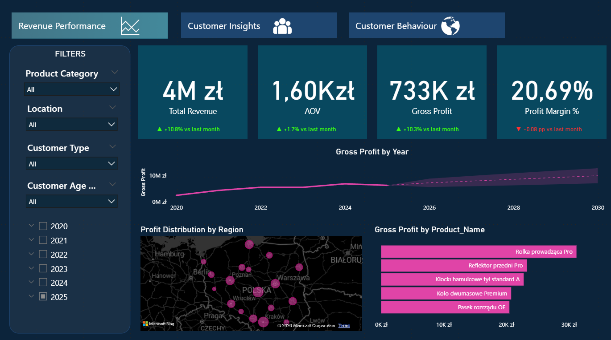
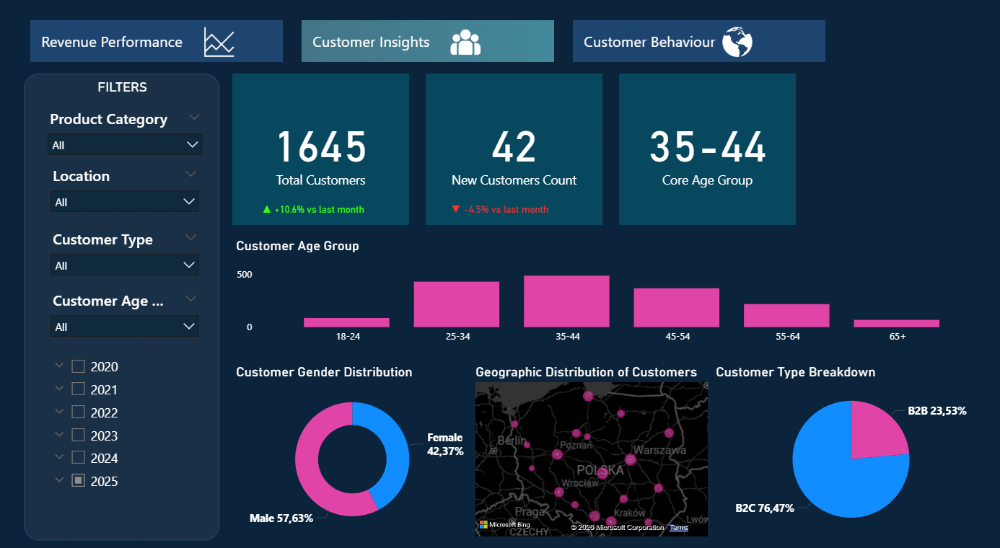
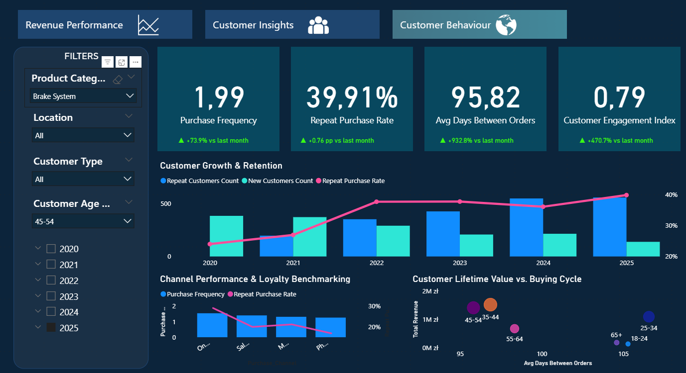
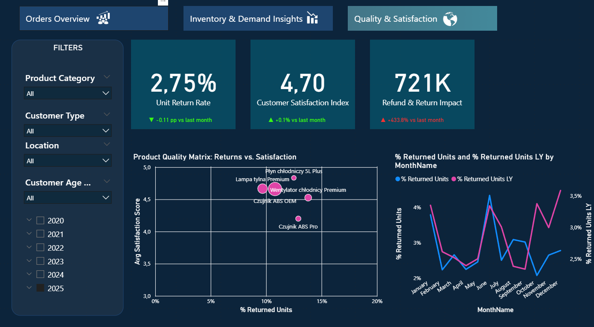
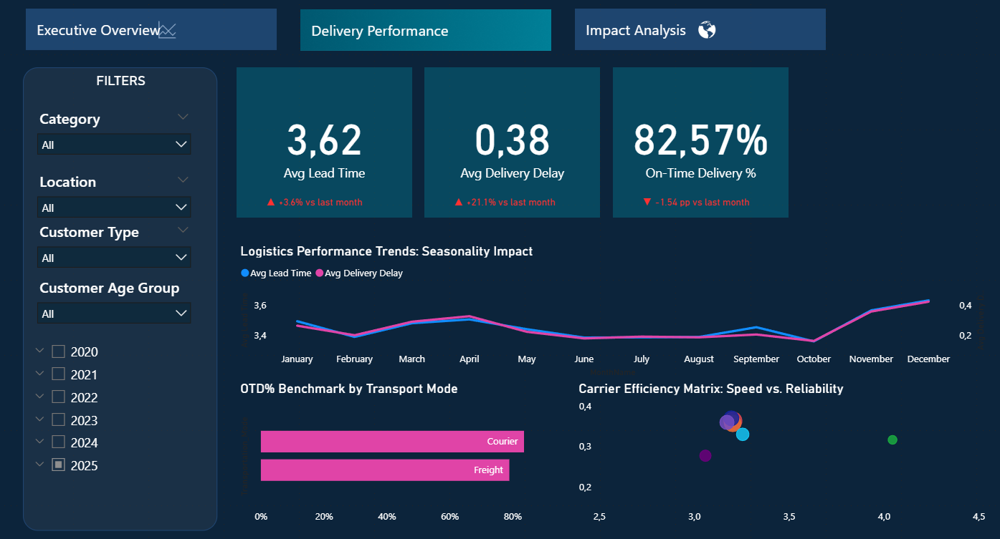

# Automotive Wholesaler Analytics

An end-to-end Power BI portfolio case study for a simulated automotive wholesale business. The project turns sales and logistics data into a decision-support report for commercial and operational stakeholders.

## Business problem

Automotive wholesalers need to balance revenue growth with profitability, product availability, customer retention, and reliable deliveries. When sales, returns, and shipping performance are reviewed separately, decision-makers cannot quickly answer critical questions:

- Which products, regions, and customer groups generate profitable growth?
- Where do returns and delivery delays create a risk to customer satisfaction?
- Which customer segments are most likely to purchase again?
- When should inventory and logistics capacity be adjusted to meet seasonal demand?

Without a shared analytical view, actions such as prioritising stock, improving carrier performance, or targeting retention campaigns rely on fragmented information rather than measurable evidence.

## Solution

This project provides an interactive Power BI report that brings together revenue, profitability, customer behaviour, returns, and delivery performance. It enables stakeholders to monitor core KPIs, explore performance by product, geography, and customer attributes, and identify areas that require attention.

The report is designed for:

| Stakeholder | Decisions supported |
| --- | --- |
| Sales and commercial teams | Prioritise profitable products, regions, and customer segments. |
| Operations and logistics teams | Monitor delivery timeliness and investigate service-performance gaps. |
| Inventory planners | Review demand patterns and plan stock around seasonal peaks. |
| Management | Track revenue, margin, customer behaviour, and operational risks from one reporting solution. |

## Dashboard capabilities

- Revenue, gross profit, profit margin, AOV, and order-volume tracking.
- Profitability analysis by product and geography.
- Customer segmentation, repeat-purchase, retention, and engagement analysis.
- Return-rate and customer-satisfaction analysis.
- Delivery timeliness and shipping-cost monitoring.
- Interactive filtering by relevant business attributes and reporting period.

## Report preview

### Revenue performance



### Customer insights



### Customer behaviour and retention



### Returns and satisfaction



### Delivery performance



## Key performance indicators

| Area | KPIs |
| --- | --- |
| Commercial performance | Total Revenue, Gross Profit, Profit Margin, Average Order Value, Order Volume |
| Customers | Repeat Purchase Rate, Customer Retention, Customer Engagement Index, Customer Satisfaction Index |
| Operations | Return Rate, On-Time Delivery Rate, Delivery Delay, Shipping Costs |

## Data and scope

> **Synthetic-data disclosure**
> This project uses a synthetic dataset generated with ChatGPT for portfolio purposes. It does not contain real company, customer, transaction, or market data. All figures and relationships shown in the report are illustrative and must not be interpreted as real-world market findings or proof of causality.

The repository currently contains the report, dashboard screenshots, a SQL reporting-schema example, and an executive presentation. It does **not** contain raw source files, a repeatable data-generation script, loading statements, or an automated ETL pipeline.

When comparing KPIs across report pages and the executive presentation, check the applied filter and date context first. A visual may represent a filtered period while a presentation metric may use a broader reporting scope.

## SQL reporting schema

The SQL script contains a compact reporting-oriented schema and analytical views used as a modelling example.

| Object | Purpose |
| --- | --- |
| `DimProduct` | Product attributes such as name, category, brand, and base price. |
| `DimCarrier` | Carrier and vehicle-type attributes. |
| `DimDate` | Calendar attributes for time-based analysis. |
| `FactOrders` | Sales-order records with product, date, carrier, quantity, revenue, and return status. |
| `FactShipping` | Shipment records with delivery lead time, costs, and delay. |
| `v_FactOrders_Analytics` | Enriches orders with product details and a readable return-status label. |
| `v_FactShipping_Analytics` | Classifies delivery delays and relates shipping records to order-return status. |

The script is a portfolio artifact, not a production deployment package. It can be extended with source-to-target mappings, data-quality checks, reproducible loading, and a fuller dimensional model.

## Repository structure

```text
.
|- Reports/
|  `- MW.pbix                                      # Interactive Power BI report
|- SQL_Scripts/
|  `- Mateusz_Wojno_Automotive_Wholesaler.sql     # Schema and analytical views
|- Documentation/
|  `- Bussiness_results.pdf                        # Executive presentation
`- Images/                                         # Dashboard previews
```

## How to review the project

1. Open [MW.pbix](Reports/MW.pbix) in Power BI Desktop.
2. Navigate through the report pages and use the available filters to inspect the KPIs.
3. Review [Mateusz_Wojno_Automotive_Wholesaler.sql](SQL_Scripts/Mateusz_Wojno_Automotive_Wholesaler.sql) for the SQL schema and analytical views.
4. Read the [executive presentation](Documentation/Bussiness_results.pdf) for the business narrative and recommendations.

## Technology stack

- Power BI Desktop
- DAX
- Power Query
- Microsoft SQL Server / T-SQL
- Microsoft PowerPoint

## Planned improvements

- Publish the report as a PBIP project to version-control semantic-model metadata and DAX measures.
- Add a reproducible synthetic-data generator with documented assumptions.
- Add source-to-target mappings, a model diagram, and a KPI glossary.
- Add data-quality tests and data-loading scripts.
- Extend the schema with additional dimensions and facts where required by the reporting scope.

## Author

Mateusz Wojno
